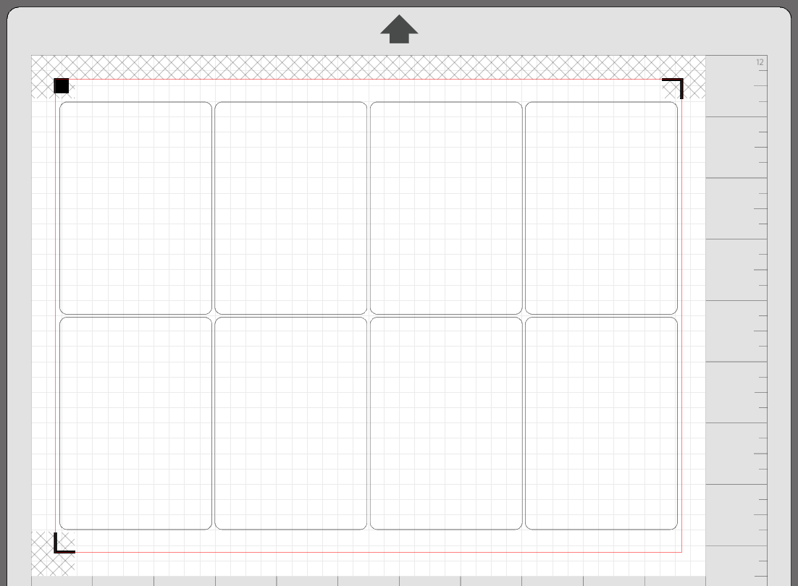
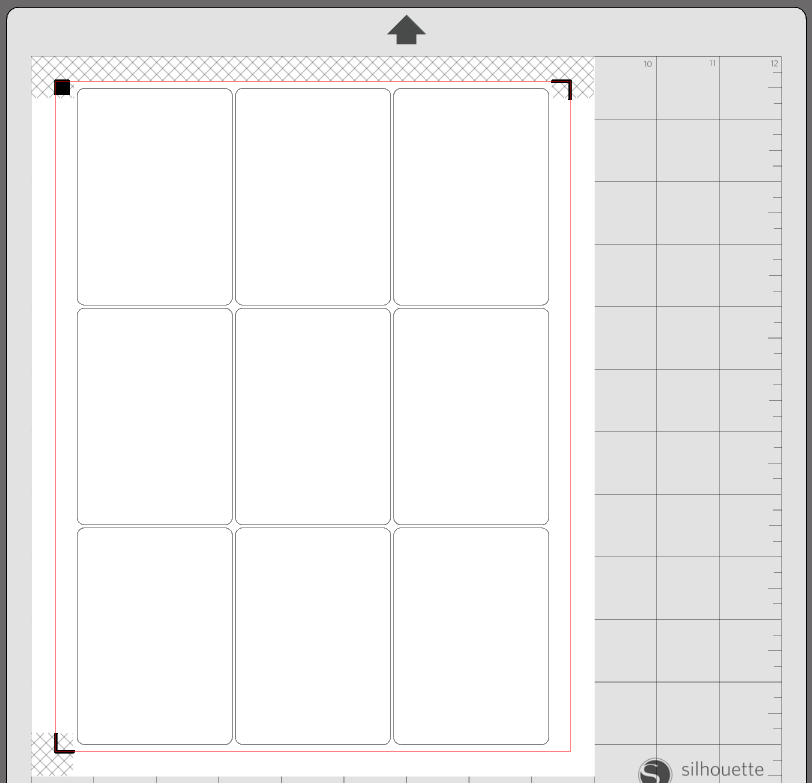
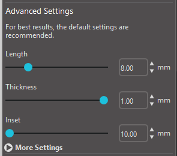
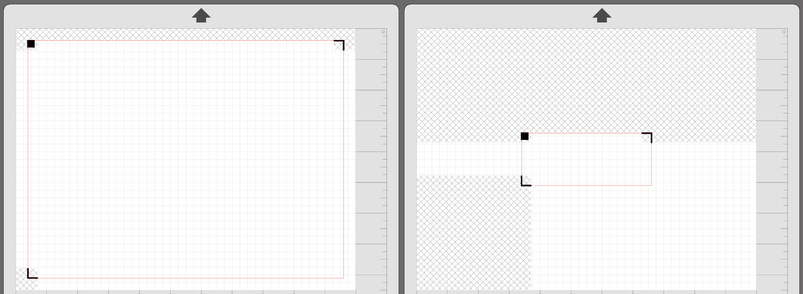
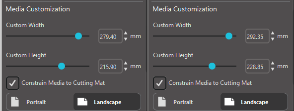
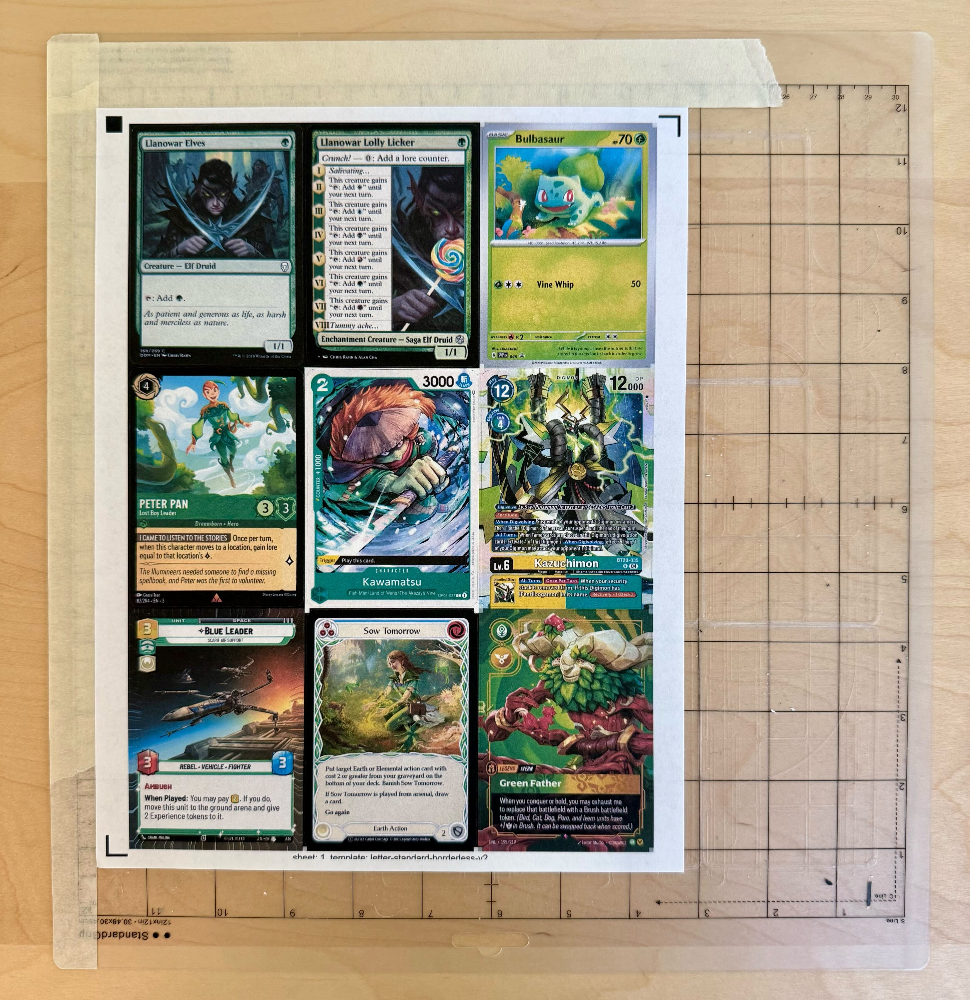
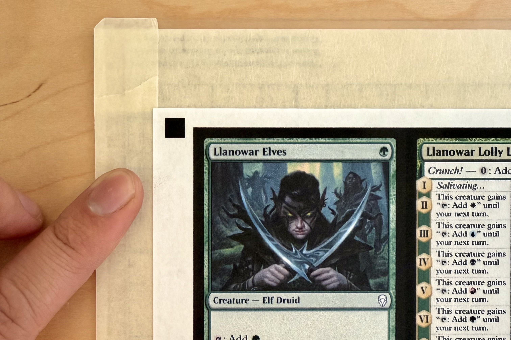
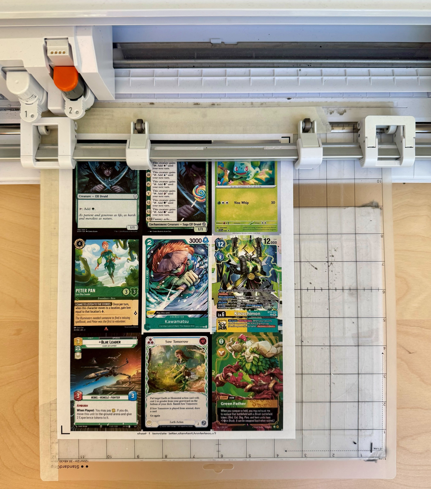

Borderless templates artificially increase the maximum cutting area and maximum number of cards per sheet.

For example, `letter` paper with `standard` card size results in a 4x2 layout:



However, with borderless templates, we can have a 3x3 layout:



## How It Works

Silhouette Studio limits the minimum inset of registration marks to 10mm.



A smaller inset would allow us to have a greater cutting area and more cards per sheet. Compare the following insets and cutting areas:



We cannot reduce the inset below 10mm as that is a hard limit set by Silhouette Studio. Instead, we can circumnavigate the limit by using custom media sizes.

By adding 13mm to the paper width and height settings, we can effectively use a 3.5mm inset.

<!--  -->

The inset is still set at 10mm in Silhouette Studio but the software believes we are using a larger piece of paper.

## Benefits

The table below shows all possible borderless paper and card size combinations, the layout of the cards, and the improvement in card count.

| Format | `letter` | `tabloid` | `a4` | `a3` | `arch_b` |
|---|---|---|---|---|---|
| `standard` | 3x3 (+1) | 6x3 (+2) | 3x3 (+1) | N/A | N/A |
| `poker` | 3x3 (+1) | 6x3 (+2) | 3x3 (+1) | N/A | N/A |
| `bridge` | 3x3 (+1) | 7x3 (+5) | 3x3 (+0) | N/A | N/A |
| `american_mini` | 6x3 (+2) | 10x4 (+4) | 6x3 (+2) | N/A | N/A |
| `bridge_square` | 4x3 (+0) | 7x4 (+0) | 4x3 (+0) | N/A | N/A |
| `business` | 2x5 (+0) | 3x7 (+1) | 2x5 (+0) | N/A | N/A |
| `catan` | 3x3 (+0) | 7x3 (+0) | 5x2 (+0) | N/A | N/A |
| `credit` | 3x3 (+1) | 3x7 (+5) | 2x5 (+0) | N/A | N/A |
| `domino` | 4x3 (+2) | 8x3 (+4) | 6x2 (+2) | N/A | N/A |
| `domino_square` | 5x4 (+0) | 9x5 (+0) | 6x4 (+4) | N/A | N/A |
| `euro_business` | 3x3 (+0) | 3x7 (+0) | 2x5 (+1) | N/A | N/A |
| `euro_mini` | 5x3 (+3) | 5x6 (+3) | 4x4 (+4) | N/A | N/A |
| `japanese` | 3x3 (+1) | 6x3 (+2) | 3x3 (+0) | N/A | N/A |
| `jumbo` | 3x1 (+1) | 2x3 (+2) | 2x2 (+1) | N/A | N/A |
| `micro` | 8x4 (+4) | 8x8 (+1) | 6x6 (+6) | N/A | N/A |
| `mini` | 4x4 (+1) | 8x4 (+0) | 6x3 (+2) | N/A | N/A |
| `standard_double` | 2x2 (+0) | 3x3 (+1) | 2x2 (+0) | N/A | N/A |
| `tarot` | 2x2 (+0) | 5x2 (+0) | 4x1 (+0) | N/A | N/A |
| `70mm_square` | 3x2 (+0) | 5x3 (+0) | 4x2 (+2) | N/A | N/A |

`a3` and `arch_b` are not supported at the moment due to this [issue](https://github.com/Alan-Cha/silhouette-card-maker/issues/136).

## Usage

Use the `--borderless` option to generate a borderless PDF.

```sh
python create_pdf.py --borderless
```

Get your borderless PDF at `game/output/game.pdf`.

Use the appropriate borderless cutting template in [cutting_templates/borderless/](https://github.com/Alan-Cha/silhouette-card-maker/tree/main/cutting_templates/borderless).

While placing the paper onto the mat, maintain 6.5mm of clearance from the edge of the grid. Recall that the software believes we are using paper that is 13mm larger in height and width. Therefore, instead of aligning the paper against the grid, we need to maintain 6.5mm (13mm/2) of clearance.

***

To improve registration reliability, you may need something to hide stray marks and to provide more white space around the registration marks.

For example, I use masking tape to hide the text in the top left and the grid lines. I place the tape 7.5mm from the grid so I can overlap my paper over the tape.




Notice the overlap. A clear gap may cause registration issues.



The rest is the same!




